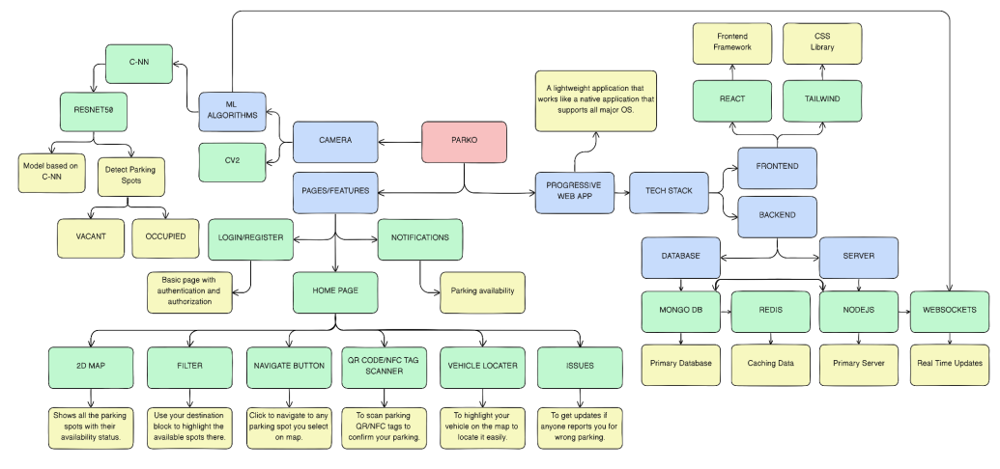
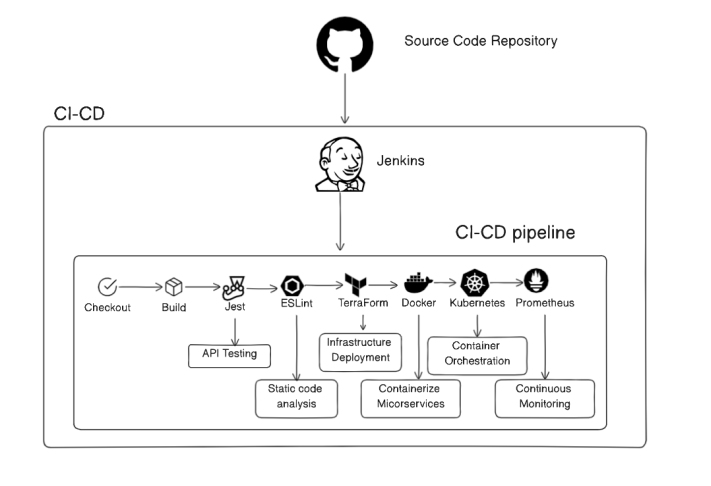
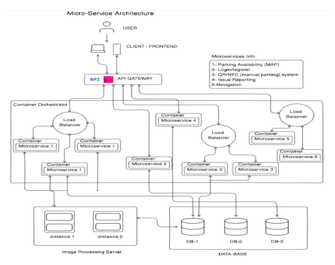
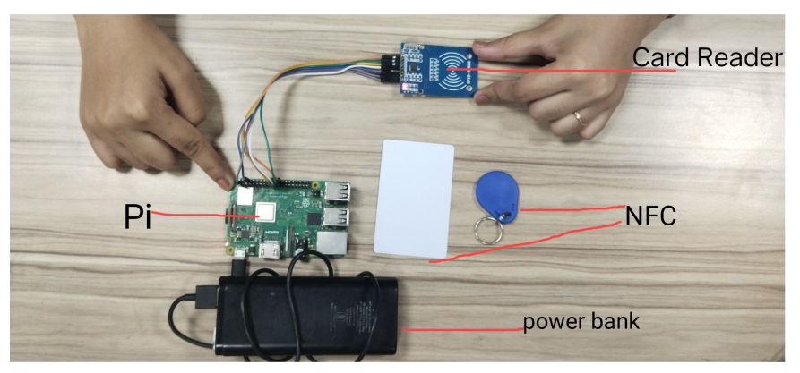

# Parko Frontend

Parko is an innovative application designed to revolutionize the parking experience at UPES. The frontend of this application provides a user-friendly interface for users to check real-time parking availability, pre-book spots, and navigate to their allocated parking space.

## Project Report

The detailed project report can be found [here](./docs/Project%20End-Term%20Report.pdf)

## Features

- **Real-Time Updates**: Get live status of parking spot availability.
- **Pre-Booking**: Reserve parking spots in advance when within a certain radius of the campus.
- **Interactive Map**: View available parking spots on an interactive 2D map.
- **Navigation**: Navigate to your allocated parking spot using the app's routing system.
- **Admin Dashboard**: Manage parking spots, user accounts, and handle user queries.

## Application Workflow Diagram



## DevOps Implementation Diagram



## MicroServices Diagram



## Raspberry Pi Setup



## Tech Stack

- **React**: JavaScript library for building user interfaces.
- **Vite**: Next-generation frontend tooling.
- **Tailwind CSS**: Utility-first CSS framework for styling.
- **PWA**: Progressive Web App for enhanced user experience.

## Installation

1. Clone the repository:

   ```bash
   git clone https://github.com/Ayroid/PARKO-Frontend.git
   ```

2. Navigate to the project directory:

   ```bash
    cd PARKO-Frontend
   ```

3. Install dependencies:

   ```bash
    npm install
   ```

4. Start the development server:
   ```bash
    npm run dev
   ```

## Usage

- Open your browser and go to http://localhost:3000 to view the application.
- Use the interactive map to check parking availability.
- Pre-book a parking spot or let the system automatically assign one.

## Contributing

We welcome contributions to improve Parko. To contribute, follow these steps:

- Fork the repository.
- Create a new branch (git checkout -b feature-branch).
- Make your changes.
- Commit your changes (git commit -m 'Add some feature').
- Push to the branch (git push origin feature-branch).
- Open a pull request.

## License

This project is licensed under the MIT License - see the LICENSE file for details.
